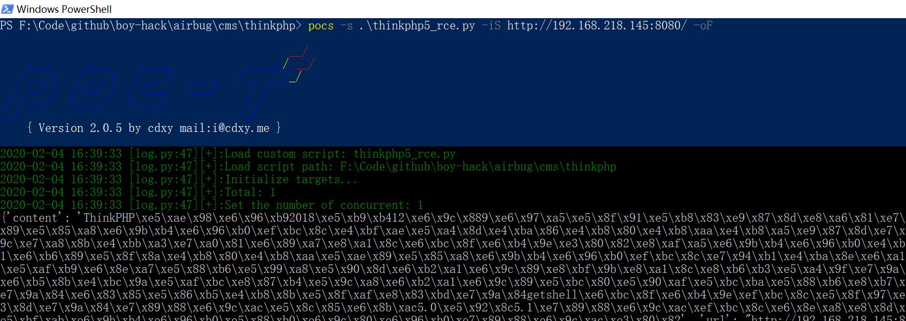

# hack-requests

具体文档参考原作者的项目: https://github.com/boy-hack/hack-requests

此项目是在原作者python3版本的HackReqeust改成了python2版本的HackRequest, 方便poc-s可以直接调用airbug的poc.

安装:

	python setup.py install

经过作者提供的单元测试脚本，目前只有test_real_host.py脚本无法通过, 但对脚本的正常运行影响不大。

这样就可以在Python2下面运行airbug的poc了。唯一的缺陷就是因为由中文编码的问题，airbug下面大部分poc都需要加上正常的utf-8编码.

```
#!/usr/bin/env python        
#coding:utf-8
```
在每个poc前面加上如上即可正常运行。

test:

	pocs -s ./cms/thinkphp/thinkphp5_rce.py -iS http://192.168.218.145:8080/ 




